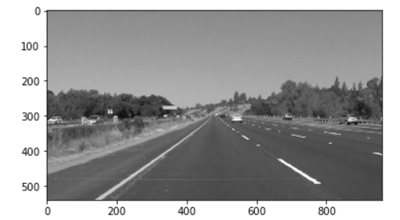
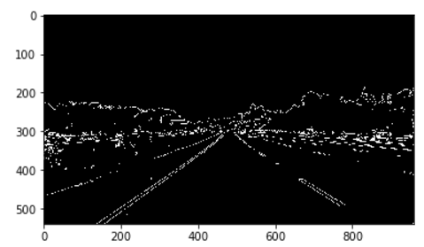
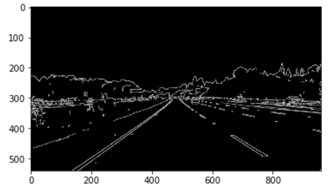
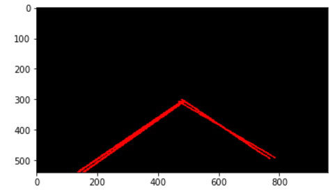
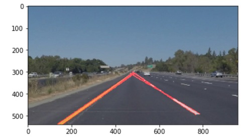

# Finding Lane Lines on the Road

## Writeup 

### Reflection

### 1.  Describe my pipeline.

My pipeline consist of 8 steps. Following are steps and result images of every step.

1) Converted the image to grayscale, function is - grayscale()

2) Canny edge detector to detect edge, function is - canny()

3) Gaussian kernel to blur edge image, function is - gaussian_blur()

4) Region of mask, function is - region_of_interest() Here I define three vertices points(left_bottom, right_bottom, apex)

5) Used hough transform to find the straight line of image, and then draw straght line to show result. Function - hough_lines() - draw_lines()

6) Draw lines on original image and shown result, function - weighted_img()

7) define a function can run all of step together, function - process_image()

8) Read vedio and then produce new result video

### 2. Potential shortcomings with my current pipeline

1) Curve line. Because of using fix mask(interesting region), when ahead line is curve, recofnition accuracy will decline and have many recognition error, just like one of my output result/challenge.mp4.

2) Dash line. When the line we detect is dash line, some part of line will miss.

3) Time-consuming. The processing time of 251 flame or images is 19.2s.

### 3. Possible improvements suggestion of pipeline

A possible improvement would be use different color channel or HSI color threshold, not just use grayscale image.
